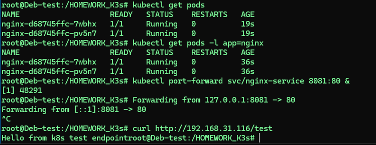

#  Установим K3s
```
curl -sfL https://get.k3s.io | sh -
```
```
sudo systemctl status k3s

```

Получим конфиг для kubectl:
```
sudo cp /etc/rancher/k3s/k3s.yaml ~/.kube/config
sudo chown $USER:$USER ~/.kube/config
export KUBECONFIG=~/.kube/config
```

Проверим работоспособность:

```
kubectl get nodes
kubectl get pods -n kube-system
```
Проверим так же

```
 kubectl get pods -A
```



## Deployment и Service для Redis
https://github.com/netology-code/sdvps-homeworks/blob/main/6-05.md


```
root@Deb-test:/HOMEWORK_K3s# echo 'apiVersion: apps/v1
kind: Deployment
metadata:
  name: redis
spec:
  selector:
    matchLabels:
      app: redis
  replicas: 1
  template:
    metadata:
      labels:
        app: redis
    spec:
      containers:
      - name: master
        image: bitnami/redis:6.0.13
        env:
         - name: ALLOW_EMPTY_PASSWORD
           value: "yes"
        ports:
        - containerPort: 6379

---
apiVersion: v1
kind: Service
metadata:
  name: redis-service
spec:
  selector:
    app: redis
  ports:
    - protocol: TCP
      port: 6379
      targetPort: 6379' > redis-deployment.yaml
      
```

```
kubectl apply -f redis-deployment.yaml
```

    


Проверим статус Pod'а:
```
kubectl get pods
```


Проверим Service
```
kubectl get svc
```


Проверим логи Redis:

```
kubectl logs redis-54457d549d-vg4dg  # (подставим имя Pod из `kubectl get pods`)

```


```
kubectl exec -it <pod-name> -- redis-cli
kubectl exec -it redis-54457d549d-vg4dg -- redis-cli
```
Эта команда:
exec - выполняет команду в контейнере
-it - делает сессию интерактивной
redis-54457d549d-vg4dg - имя вашего Pod
-- redis-cli - команда для запуска Redis CLI внутри контейнера


Выполните тестовые команды:

```
SET test "Hello Kubernetes"
GET test
```


### Проверить процессы в контейнере
kubectl exec redis-54457d549d-vg4dg -- ps aux


### Посмотреть логи Redis
kubectl logs redis-54457d549d-vg4dg


### Проверить переменные окружения
kubectl exec redis-54457d549d-vg4dg -- env


### Проброс порта для отладки:
```
kubectl port-forward redis-54457d549d-vg4dg 6379:6379
```

### Удаление контейнера (Pod):
```
kubectl delete pod redis-54457d549d-vg4dg
```


#### Если нужно полностью пересоздать Deployment

```
kubectl delete -f redis-deployment.yaml

или 
kubectl delete deployment redis
kubectl delete service redis-service

```
резвернем заново
```
kubectl apply -f redis-deployment.yaml
```


#### Масштабирование (изменить количество реплик):
```
kubectl scale deployment redis --replicas=2
```
#### Полная пересборка Deployment (принудительный перезапуск):
```
kubectl rollout restart deployment redis
```
#### Просмотр истории развертывания:
```
kubectl rollout history deployment redis
```


Создадим файл nginx-k8s.yaml со следующим содержимым:
[text](nginx-k3s.yaml)

```
kubectl apply -f nginx-k8s.yaml
```


Проверим ConfigMap:
```
 kubectl describe configmap nginx-config
```


```
kubectl get pods -l app=nginx

```
